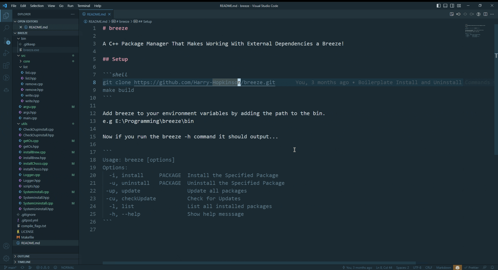

  

<h2 align="center">Run Exe</h2>

  
  
  
  
  
  

**run-exe** is an Visual Studio Code extension that allows you to run `.exe` files.

## Features

- Run `.exe` files by clicking button right of the tab bar
- Run `.exe` files from the editor tab context menu for `.exe` files
- Run `.exe` files from the file explorer context menu for `.exe` files
- Run `.exe` files from the editor context menu for `.exe` files
- Use the command `Run Executable` to run `.exe` files

## Example

